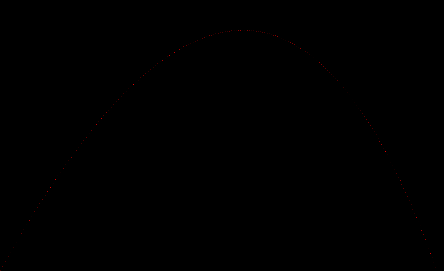

# Ray Tracer with Rust

### Building Ray Tracer, with Rust and TDD

##### Work in progress
```
Currently implemented:
Canvas - for creating images
Color - for painting over canvas
Tuples - Vector & Point tuples for calculation
Utils - utility functions for numbers
```

## Progress

### #1 Canvas Creation (ala Picasso)

